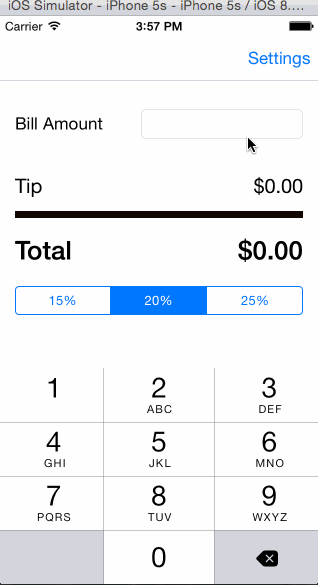

This is a Tip Calculator application for iOS submitted as the pre-assignment requirement for Codepath.

Time spent: 7 hours

Completed:

Required: User can enter a bill amount, choose a tip percentage, and see the tip and total values.
Required: Settings page to change the default tip percentage.

